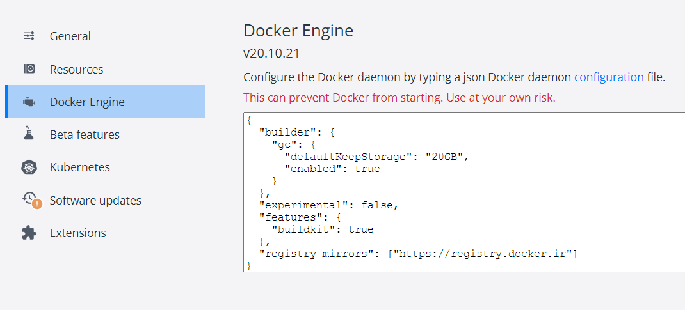

# Docker Mirror 设置

## Docker Desktop



参考配置：
```
"registry-mirrors": [
    "https://docker.m.daocloud.io",
    "https://mirror.baidubce.com"
  ]
```

## Docker Engine
创建或修改 /etc/docker/daemon.json：
```
sudo mkdir -p /etc/docker
sudo tee /etc/docker/daemon.json <<-'EOF'
{
    "registry-mirrors": [
        "https://dockerproxy.com",
        "https://docker.mirrors.ustc.edu.cn",
        "https://docker.nju.edu.cn"
    ]
}
EOF
sudo systemctl daemon-reload
sudo systemctl restart docker
```

Reference:
[Docker Hub 镜像加速器](https://gist.github.com/y0ngb1n/7e8f16af3242c7815e7ca2f0833d3ea6)