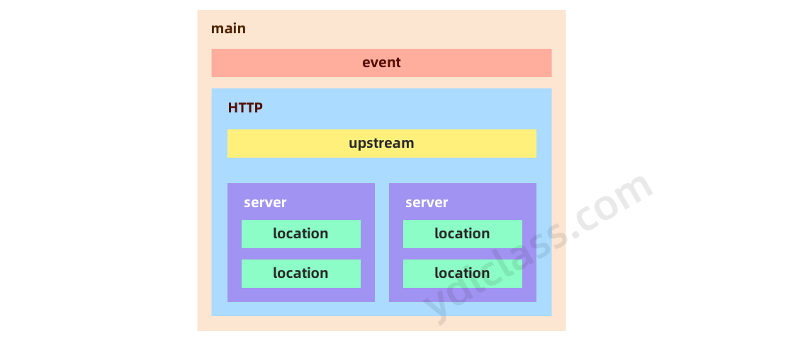

# nginx 速查

## nginx可以提供的服务

1.  web 服务
2.  负载均衡 （反向代理）日pv2000W以下，都可以直接用nginx做代理。
3.  web cache（web 缓存）

## nginx 的优点

1.  比其他服务器响应更快。
2.  高扩展，nginx的设计极具扩展性，他是由多个功能不同且耦合性极低的模块组成。
3.  单机支持并发极高，理论上支持10万的并发连接，nginx支持的并发连接和内存相关，超过10万也是可以的。
4.  低内存消耗，10000个非活跃的http keep-alive链接在nginx中仅仅消耗2.5M的内存。
5.  支持热部署，如不用停止服务就能重新加载配置文件。
6.  极具自由的BSD许可协议。我们不仅可以直接阅读nginx的源代码、还能用来修改升级。

## 命令

测试nginx配置文件是否正常(配置文件默认在：/etc/nginx/nginx.conf)

```
nginx -t
```

启动nginx服务器

```
nginx
```

nginx -s

```
nginx -s signal
signal：
stop — 立马关闭
quit — 优雅关闭，处理完没处理好的请求后关闭
reload — 重新加载配置文件
reopen — reopening the log files
用来打开日志文件，这样nginx会把新日志信息写入这个新的文件中
```

## nginx配置文件

nginx配置文件主要分为四个部分：

```
main{ #（全局设置）
    http{ #服务器配置
        upstream{} #（负载均衡服务器设置）
        server{ #（主机设置：主要用于指定主机和端口）
            location{} #（URL匹配的设置）
        }
    }
}
```

server继承自main，location继承自server，upstream即不会继承其他设置也不会被继承。



## main

nginx在运行时与具体业务功能无关的一些参数，比如工作进程数，运行的身份等。

```
user ydlclass;
worker_processes 4;
worker_cpu_affinity 0001 0010 0100 1000;
error_log  /data/nginx/logs/error.log  crit;
pid        /data/nginx/logs/nginx.pid;
worker_rlimit_nofile 65535;
```

-   `user nginx;`: 指定nginx进程使用什么用户启动
-   `worker_processes 4;` : 指定启动多少进程来处理请求，一般情况下设置成CPU的核数，如果开启了ssl和gzip应该设置成与逻辑CPU数量一样甚至为2倍，可以减少I/O操作。使用`grep ^processor /proc/cpuinfo | wc -l`查看CPU核数。
-   `worker_cpu_affinity 0001 0010 0100 1000;`: 在高并发情况下，通过设置将CPU和具体的进程绑定来降低由于多核CPU切换造成的寄存器等现场重建带来的性能损耗。如worker\_cpu\_affinity 0001 0010 0100 1000; （四核）。
-   `error_log logs/error.log;`: error\_log是个主模块指令，用来定义全局错误日志文件。日志输出级别有debug、info、notice、warn、error、crit可供选择，其中，debug输出日志最为最详细，而crit输出日志最少。
-   `pid logs/nginx.pid;`: 指定进程pid文件的位置。

我们可以使用`ps -ef | grep nginx`查看master和worker的进程。

## events

events 模块主要是nginx 和用户交互网络连接优化的配置内容，我们主要看一下两个配置：

```
events{
  use epoll;
  worker_connections  65536;
}
```

-   `use epoll;`是使用事件模块指令，用来指定Nginx的工作模式。Nginx支持的工作模式有select、poll、kqueue、epoll、rtsig和/dev/poll。其中select和poll都是标准的工作模式，kqueue和epoll是高效的工作模式，不同的是epoll用在Linux平台上，而kqueue用在BSD系统中。对于Linux系统，epoll工作模式是首选。在操作系统不支持这些高效模型时才使用select。
-   `worker_connections 65536;`每一个worker进程能并发处理（发起）的最大连接数。

## 负载均衡：upstream

nginx 的负载均衡功能依赖于 ngx\_http\_upstream\_module模块。upstream 模块应该放于http{}标签内。

模块写法如下：

```
upstream backend {
    ip_hash; 
    server backend1.example.com;
    server backend2.example.com:8080;
    server 127.0.0.1:8080;
    server backup2.example.com:8080;
}
```

然后在location处使用如下写法：

```
location / {
    proxy_pass http://backend;
}
```

以上写法的意思就是，将来同一个url访问我们的服务时，服务可以由backend中的服务器按照某种特定规则轮流提供。

### ngixn负载均衡的五种算法

（1）round robin 轮询 （默认） 按时间顺序依次将请求分配到各个后台服务器中，挂掉的服务器自动从列表中剔除

```
upstream bakend {  
   server 192.168.0.1 down;    
   server 192.168.0.2;  
}
```

（2）weight 轮询权重 weight的值越大分配到的访问概率越高，主要用于后端每台服务器性能不均衡的情况下，或在主从的情况下设置不同的权值，达到合理有效的地利用主机资源。

```
upstream bakend {  
    server 192.168.0.1 weight=20;  
    server 192.168.0.2 weight=10;  
}
```

（3）ip\_hash：每个请求按访问IP的哈希结果分配，使来自同一个IP的访客固定访问一台后端服务器，并且可以有效解决动态网页存在的session共享问题。

```
upstream bakend {  
    ip_hash;  
    server 192.168.0.1:88;  
    server 192.168.0.2:80;  
} 
```

（4）url\_hash：按访问的URL的哈希结果来分配请求，使每个URL定向到同一台后端服务器，可以进一步提高后端服务器缓存的效率。Nginx本身不支持url\_hash，需要安装Nginx的hash软件包。

```
upstream backend {  
    server 192.168.0.1:88;     //使用hash语句时，不能在使用weight等其他参数
    server 192.168.0.2:80;  
    hash $request_uri;  
    hash_method crc32;    //使用hash算法
}
```

（5）fair算法：可以根据页面大小和加载时间长短智能地进行负载均衡，根据后端服务器的响应时间来分配请求，响应时间短的优先分配。Nginx本身不支持fair，要安装upstream\_fair模块才能使用。

```
upstream backend {  
    server 192.168.0.1:88;  
    server 192.168.0.2:80;  
    fair;  
}
```

## http

```
http{
  include       mime.types;
  default_type  application/octet-stream;
  #charset  gb2312;
  sendfile        on;
  keepalive_timeout  60s;
}
```

-   include是个主模块指令，实现对配置文件所包含的文件的设定，可以减少主配置文件的复杂度。该文件也在conf目录中。
-   default\_type属于HTTP核心模块指令，这里设定默认类型为二进制流，也就是当文件类型未定义时使用这种方式。
-   charset gb2312; 指定客户端编码格式。
-   sendfile实际上是 Linux2.0+以后的推出的一个系统调用，web服务器可以通过调整自身的配置来决定是否利用 sendfile这个系统调用。sendfile是个比 read 和 write 更高性能的系统接口。 当 Nginx 是一个静态文件服务器的时候，开启 SENDFILE 配置项能大大提高 Nginx 的性能。 但是当 Nginx 是作为一个反向代理来使用的时候，SENDFILE 则没什么用。
-   Nginx 使用 keepalive\_timeout 来指定 KeepAlive 的超时时间（timeout）。指定每个 TCP 连接最多可以保持多长时间。Nginx 的默认值是 75 秒，有些浏览器最多只保持 60 秒，所以可以设定为 60 秒。若将它设置为 0，就禁止了 keepalive 连接。

## server：静态服务

http服务上支持若干server。

```
server{
    listen 80 default;
    server_name www.ydlclass.com;
    index index.html index.htm index.php;
    root /data/www;

    location ~ .*\.(gif|jpg|jpeg|png|bmp|swf)${
        expires      30d;
    }

    location ~ .*\.(js|css)?${
        expires      1h;
    }
}
```

-   `listen 80;` 监听端口，默认80，小于1024的要以root启动。可以为listen :80、listen 127.0.0.1:80等形式。
-   `server_name www.ydlclass.com` 用于设置虚拟主机服务名称，如：127.0.0.1 、 localhost 、域名\[[www.baidu.comopen in new window](http://www.baidu.com/) | [www.jd.comopen in new window](http://www.jd.com/)\]，也可以进行正则匹配。
-   `root /data/www` 定义服务器的默认网站根目录位置。可以是linux的绝对路径（/xxx/xx），也可以是nginx安装目录的相对路径（html）。
-   `index index.jsp index.html index.htm` ：定义路径下默认访问的文件名，一般跟着root放。

### location 常见的配置项：

location通常用来匹配uri，其基本语法如下：

```
location [=|~|~*|^~] /uri/ {}
```

（1）=表示匹配uri时必须做到完全匹配

（2）~表示匹配URI时是字母大小写敏感的，可以使用正则表达式。

（3）~\*表示匹配URI时是忽略字母大小敏感的，可以使用正则表达式。

（4）^~表示匹配uri时只需满足前缀匹配即可

```
# 所有 /./img/开头的uri会全部匹配
location ^~ /./img/ {}
```

（5）uri参数中是可以使用正则表达式的，如匹配以 .gif .jpg和.jpeg结尾的uri，如下:

```
location ~* \.(gif|jpg|jpeg)$ {}
```

（6）以下方式可以匹配所有的uri

（7）`@` 指定一个命名的location，一般用于内部重定义请求：

```
location @name {…}
```

结果总结： 匹配的优先顺序，`=`\>`^~`（匹配固定字符串，忽略正则）>`~*`\>`/` ，工作中尽量将‘=’放在前面。

### 文件路径的定义

（1）以root方式设置资源路径

语法 root path ，默认 root html，可以在http、server、location模块中配置。

```
location ^~ /backend {
	root /data/www/backend
}
```

如果url为 `/backend/index/test.html`则会返回/data/www/backend/backend/index/test.html这个文件。

（2）以alias方式设置资源路径

alias也是用来设置文件资源的，它和root不同点在于如何解读紧跟location后面的uri参数，可以在location中配置：

```
location ^~ /backend {
	alias /data/www/backend
}
```

如果url为 `/backend/index/test.html`则会返回/data/www/backend/index/test.html文件。

alias会将location后的url部分丢弃掉，而root不会。

（3）访问首页

可以在http、server、location中配置。

```
index index.html index.htm index.php
```

nginx会依次访问index中定义的文件，知道访问成功为止。

（4）根据http返回码重定向页面

可以在http、server、location中配置。

```
error_page 404 /404.html
error_page 502 503 504 /50x.html
```

（5）try\_files

```
try_files path1 path2 ... uri
```

该配置项可以配置在server、location模块。

try\_files后边会跟若干路径，nginx会尝试按照顺序访问每一个path，如果可以有效的读取，就直接访问当下path资源，否则继续向下访问，如果都读取不到就重定向到uri参数上

```
try_files /a/b.html $uri $uri/index.html $uri.html @other;
location @other {
    proxy_pass http://backend
}
```

### SPA路由问题

vue工程都是单页面的，所以无论哪个路由都应该使用唯一的index.html，所以我们可以做如下的配置，该配置的意思就是将其他的所有请求，都强制使用/index.html：

```
location / {
    root /data/www/ui;
    try_files /index.html;
}
```

但是这个有问题的，比如下边的请求，也会强制使用index.html，我明明需要js，你却给我一个HTML：

```
http://192.168.111.201/js/app.aa11d15b.js
```

所以配置要改成下边的内容，$uri是一个变量，他就是具体的url，对一`/js/app.aa11d15b.js`这个请求，首先会访问`/data/www/ui/js/app.aa11d15b.js`这个资源，当然存在，就直接返回了，而其他的路由资源会使用index.html：

```
location / {
    root /data/www/ui;
    try_files $uri $uri/ $uri/index.html $uri.html /index.html;
}
```

### 图片开启gzip压缩

在http模块中添加如下内容：

```
gzip on;
gzip_min_length 1k;
gzip_buffers    4 16k;
gzip_http_version 1.1;
gzip_comp_level 5;
gzip_types image/png;
gzip_vary on;
```

解释如下：

-   gzip on;使用"gzip on;"参数来启用压缩，默认是关闭的。
    
-   gzip\_min\_length 1k;gzip压缩的最小文件，小于设置值的文件将不会压缩#指定Nginx服务需要向服务器申请的缓存空间的个数\*大小，默认32 4k|16 8k;
    
-   gzip\_buffers 4 16k;设置压缩缓冲区大小，此处设置为4个16K内存作为压缩结果流缓存
    
-   gzip\_http\_version 1.1;启用压缩功能时，协议的最小版本，默认HTTP/1.1
    
-   gzip\_comp\_level 5;压缩比例由低到高从1到9，默认为1。但需要注意的是压缩比设置的越高就会越消耗CPU的资源，因此在生产环境中我们会设置该参数的值在3~5之间，最好不要超过5，因为随着压缩比的增大的确会降低传输的带宽成本但发送数据前会占用更多的CPU时间分片。
    
-   gzip\_types image/png;指明仅对哪些类型的资源执行压缩操作；默认为gzip\_types text/html，不用显示指定，否则出错。
    
-   gzip\_vary on;该指令用于设置在使用Gzip功能时是否发送带有“Vary: Accept-Encoding”头域的响应头部。该头域的主要功能是告诉接收方发送的数据经过了压缩处理。开启后的效果是在响应头部添加了Accept-Encoding: gzip，这对于本身不支持Gzip压缩的客户端浏览器是有用的。
    

通过 Response Header的 Content-Encoding: gzip 确认gzip效果。

### 列出目录 autoindex

Nginx默认是不允许列出整个目录的。如需此功能，打开nginx.conf文件，在location，server 或 http段中加入如下参数：这个功能我们可以做一个资源下载站。

```
location ^~ /file {
    root   /data/www;
    autoindex on;
    autoindex_exact_size off;
    autoindex_localtime on;
    charset utf-8,gbk;
}
```

-   `autoindex on;`运行列出目录内容。另外两个参数最好也加上去。
-   `autoindex_exact_size off;` 默认为on，显示出文件的确切大小，单位是bytes。改为off后，显示出文件的大概大小，单位是kB或者MB或者GB。
-   `autoindex_localtime on;` 默认为off，显示的文件时间为GMT时间。改为on后，显示的文件时间为文件的服务器时间。

## server 反向代理

我们可以通过proxy\_pass参数设置反向代理的服务器，语法如下：

```
location / {
    proxy_pass http://ydl.com;
}
```

### location 中的 rewrite
```
location ^~ /api/ {
    rewrite ^/api(.*)$ $1 break;
    proxy_pass http://127.0.0.1:8080;
}
```

更简单的做法是，在代理地址的后边加`/`，这样做也会去掉前缀，但不如以上方式灵活：

```
location ^~ /api/ {
    proxy_pass http://127.0.0.1:8080/;
}
```

1.  rewrite break：url重写后，直接使用当前资源，不再执行location里余下的语句，完成本次请求，地址栏url不变
    
2.  rewrite last：url重写后，马上发起一个新的请求，再次进入server块，重试location匹配，超过10次匹配不到报500错误，地址栏url不变
    
3.  rewrite redirect：返回302临时重定向，地址栏显示重定向后的url。

## 跨域：增加 Header 信息

只需要在客户端发送【预检请求】时指定对应的响应头即可，nginx可以很方便的给响应增加一些首部信息，方法如下，在：

```
location ^~ /api/ {
    add_header 'Access-Control-Allow-Origin' '*';
	add_header 'Access-Control-Allow_Credentials' 'true';
	add_header 'Access-Control-Allow-Headers' 'Authorization,Accept,Origin,DNT,X-CustomHeader,Keep-Alive,User-Agent,X-Requested-With,If-Modified-Since,Cache-Control,Content-Type,Content-Range,Range';
	add_header 'Access-Control-Allow-Methods' 'GET,POST,OPTIONS,PUT,DELETE,PATCH';
    proxy_pass http://ydlclass/;
}
```

## nginx监控

开启nginx的监控服务

```
location = /status {  
  stub_status on;   	#表示开启stubStatus的工作状态统计功能。
}
```

| 状态码 | 表示的意义 |
| --- | --- |
| Active connections | 当前所有处于打开状态的连接数 |
| accepts | 总共处理了多少个连接 |
| handled | 成功创建多少握手 |
| requests | 总共处理了多少个请求 |
| Reading | 表示正处于接收请求状态的连接数 |
| Writing | 表示请求已经接收完成，且正处于处理请求或发送响应的过程中的连接数 |
| Waiting | 开启keep-alive的情况下，这个值等于active - (reading + writing)，意思就是Nginx已处理完正在等候下一次请求指令的驻留连接 |

## 访问控制 allow/deny

Nginx 的访问控制模块默认就会安装，而且写法也非常简单，可以分别有多个allow,deny，允许或禁止某个ip或ip段访问，依次满足任何一个规则就停止往下匹配。如：

```
location /status {
  stub_status on;
  access_log off;
  allow 192.168.10.100;
  allow 172.29.73.0/24;
  deny all;
}
```

